<!-- ॐ -->

<table border="0" cellpadding="0" cellspacing="0" width="100%">
<tr>
<td width="62%" valign="middle" style="border:none; padding-right:34px">

# Harshet Jain.

Senior SRE at **Qubole** — multi-cloud Kubernetes in production (EKS + GKE), enterprise SLAs with penalty clauses, 100+ Terraform-managed resources across AWS Organizations.

Cut cloud spend 30% (~$60K/year). Cut MTTR from 60 min to under 20. Led SOC2 Type II in 6 months. Zero audit findings.

`AWS` `GCP` `Kubernetes` `Terraform` `Prometheus` `ArgoCD` `Python` `Go`

 

&nbsp;
&nbsp;
&nbsp;

</td>
<td width="38%" valign="middle" style="border:none">

</td>
</tr>
</table>

---

> *"I don't just keep the lights on. I make sure the building was designed so the lights can't go off."*

---

### [`terraform-aws-eks-fargate-cluster`](https://github.com/Harshetjain666/terraform-aws-eks-fargate-cluster) &nbsp; ★ 32 &nbsp; ⑂ 59

Production-ready EKS + Fargate module. VPC, IRSA, RBAC out of the box. Battle-tested at Qubole.

---

AWS Community Builder · New Delhi · open to remote

